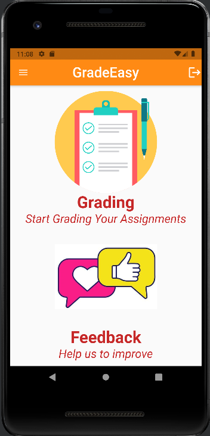

<h1> GradeEasy </h1>

This application calculates the semantic similarity between two documents using Latent Semantic Analysis (LSA) and Bilingual Evaluation Understudy (BLEU).

<h2> Screenshots </h2>

    
    
    
    
    
    
    
    
    

